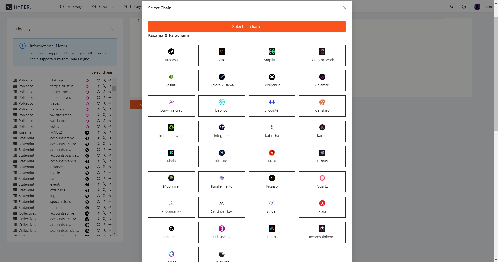
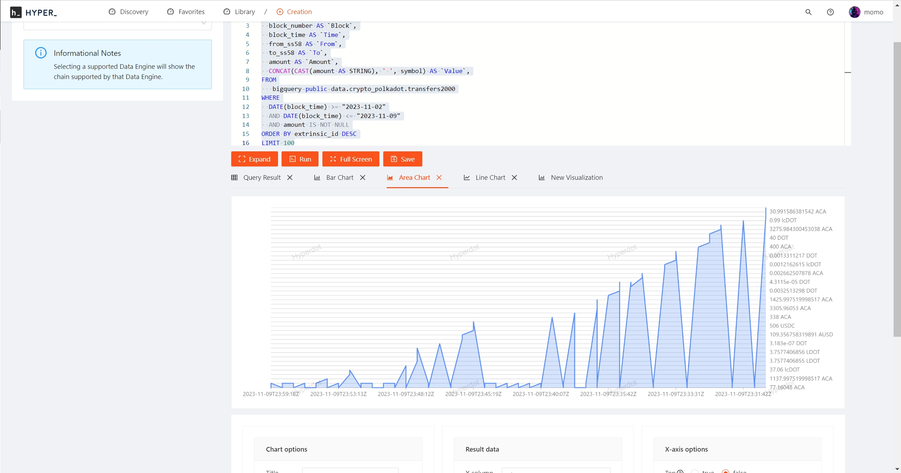
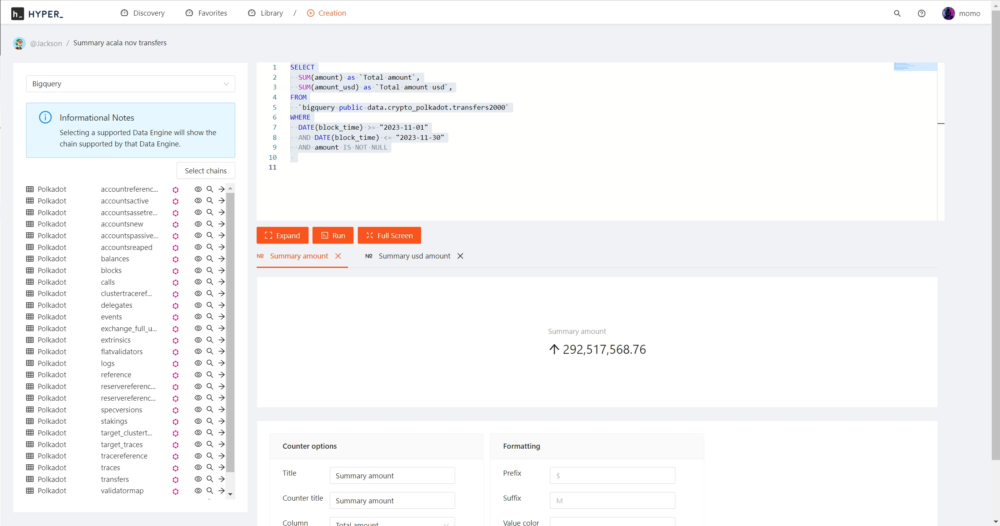
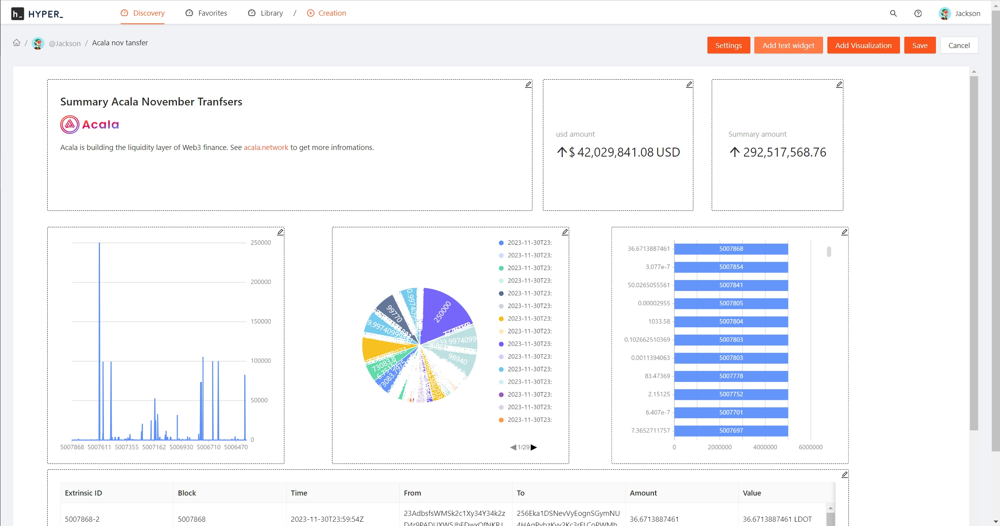
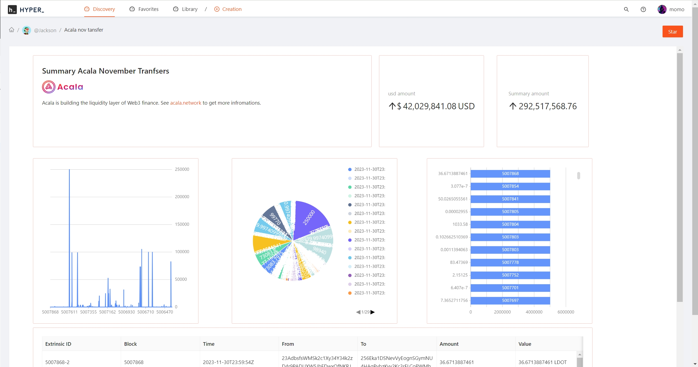
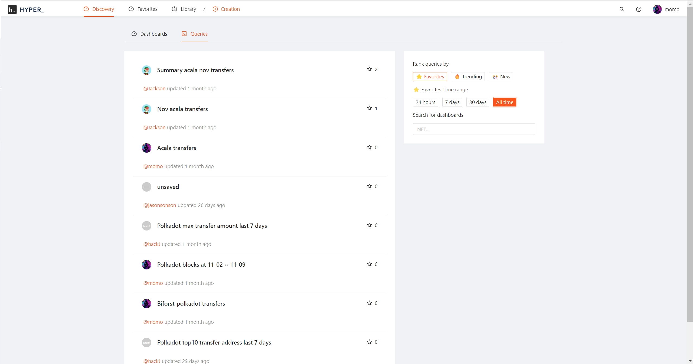

## What is Hyperdot

Hyperdot is a blockchain analytics platform that allows access to and consumption of on-chain data. It can be thought of as the GitHub of the blockchain world, with its core focus on data analysis and visualization. With the help of this tool, Hyperdot users can view and exchange data from various sources, including Polkadot, Kusama, Moonbeam, Acala, HydraDX, Astar, Hashed, and hundreds of other parallel chains.

## What is Hyperdot-fronted

Hyperdot-fronted, the UI component of the Hyperdot project, can be accessed through [www.hyperdot.xyz](https://www.hyperdot.xyz) in its alpha version. It serves as a powerful interface for analyzing on-chain data, creating visualizations through charts, and facilitating user collaboration and sharing of creative insights.

### Features

#### 1. Multi-Chain Data Support

Hyperdot Frontend seamlessly integrates with multiple blockchains, including but not limited to Polkadot, Kusama, Moonbeam, Acala, HydraDX, Astar, Hashed, and many other parallel chains. This integration ensures that users have a comprehensive view of the decentralized landscape.



#### 2. On-chain Data Analysis and Query



Hyperdot Frontend allows users to perform comprehensive on-chain data analysis and queries, providing valuable insights into blockchain activities.



#### 3. Chart Visualization Creation



Users can leverage hyperdot-fronted to create visually appealing charts and graphs based on the analyzed data, enabling a deeper understanding of blockchain trends.



#### 4. User-Created Content Sharing

Facilitating collaboration and knowledge sharing, hyperdot-fronted enables users to create and share their data analysis and visualizations within the Hyperdot community.



## Getting Started

Hyperdot Frontend seamlessly integrates with Hyperdot Node, utilizing the services and interfaces it provides. To learn how to run Hyperdot Node, visit [Hyperdot Node Documentation](https://github.com/Infra3-Network/hyperdot-node).

## Docker Installation Guide

Running the application using Docker allows for minimal setup and quick deployment. It is recommended for evaluation purposes, such as local development.

1. Clone the project to your local machine:

   ```shell
   git clone https://github.com/Infra3-Network/hyperdot-fronted.git
   ```

2. Build the Docker image:

   ```shell
   make build/docker
   ```

3. Start, stop, or remove the containers with the following commands:

   ```shell
   # Start
   make up

   # Stop
   make stop

   # Remove
   make rm
   ```

> By default, hyperdot-fronted will use hyperdot-node http://127.0.0.1:3030 , if you want to change it, you can use the following command
>
> ```shell
> make up PROXY_PASS=<You address>
> ```

8. Now, the hyperdot-fronted service should be running. Try accessing http://localhost:8000 to explore!

## Testing

> Note: Before running the tests, you should compile the docker image

This will guide you through the steps to test various aspects of the publisher node.

```shell
make test
```

Should output

```shell
> ant-design-pro@5.2.0 serve
> umi-serve


Running 14 tests using 8 workers

     1 [chromium] › tests/e2e.creations.spec.ts:16:5 › test creation query page
     2 [firefox] › tests/e2e.user.spec.ts:5:5 › test login page

   ┌────────────────────────────────────────────────┐
   │                                                │
   │   Serving your umi project!                    │
   │                                                │
   │   - Local:            http://localhost:8001    │
   │   - On Your Network:  http://172.17.0.3:8001   │
   │                                                │
   │   Copied local address to clipboard!           │
   │                                                │
  ✓  1 [chromium] › tests/e2e.creations.spec.ts:16:5 › test creation query page (13.0s)
  ✓  2 [firefox] › tests/e2e.user.spec.ts:5:5 › test login page (13.9s)
  ✓  3 [chromium] › tests/e2e.user.spec.ts:5:5 › test login page (4.0s)
  ✓  4 [chromium] › tests/e2e.explore.spec.ts:15:5 › test explore dashboard page (12.1s)
  ✓  5 [firefox] › tests/e2e.profile.spec.ts:15:5 › test profile page (18.8s)
  ✓  6 [firefox] › tests/e2e.creations.spec.ts:16:5 › test creation query page (22.7s)
  ✓  7 [firefox] › tests/e2e.explore.spec.ts:15:5 › test explore dashboard page (23.2s)
  ✓  8 [chromium] › tests/e2e.profile.spec.ts:15:5 › test profile page (7.3s)
  ✓  9 [chromium] › tests/e2e.user.spec.ts:20:5 › test register page (4.1s)
  ✓  10 [chromium] › tests/e2e.explore.spec.ts:27:5 › test explore query page (12.0s)
  ✓  11 [chromium] › tests/e2e.creations.spec.ts:34:5 › test creation dashboard page (9.6s)
  ✓  12 [firefox] › tests/e2e.user.spec.ts:20:5 › test register page (6.5s)
  ✓  13 [firefox] › tests/e2e.creations.spec.ts:34:5 › test creation dashboard page (7.3s)
  ✓  14 [firefox] › tests/e2e.explore.spec.ts:27:5 › test explore query page (8.7s)

  Slow test file: [firefox] › tests/e2e.explore.spec.ts (31.9s)
  Slow test file: [firefox] › tests/e2e.creations.spec.ts (30.1s)
  Slow test file: [chromium] › tests/e2e.explore.spec.ts (24.2s)
  Slow test file: [chromium] › tests/e2e.creations.spec.ts (22.6s)
  Slow test file: [firefox] › tests/e2e.user.spec.ts (20.3s)
  Consider splitting slow test files to speed up parallel execution
  14 passed (36.5s)
```

### Run Tests

Before running tests, you will need to configure Google Application Credentials and the Polkaholic API key. If you have completed the configuration, you can run the tests using the following command. Otherwise, you can refer to the [Prerequisites](#prerequisites) section on how to configure them.

After creating the credentials, you need to modify the configuration file:

```shell
cp tests/hyperdot-sample.test.json  tests/hyperdot.test.json
```

Modify the `tests/hyperdot.test.json` configuration by updating the `apiKey` and `projectId` in the `polkaholic` and `bigquery` sections:

```json
{
  "polkaholic": {
    "apiKey": "<YOUR_API_KEY>",
    "baseUrl": "https://api.polkaholic.io"
  },

  "bigquery": {
    "projectId": "<YOUR_PROJECT_ID>"
  }
}
```

Then, run the tests with the following command:

```shell
# Ensure dependencies installed
go mod tidy

go mod vendor

make tests
```

### Run Lint

If you want to run lint to check your code, you will need to:

- Install golangci-lint. You can refer to [Install](https://golangci-lint.run/usage/install/).

```shell
make lint
```

## Troubleshooting

1. For users in China, if you encounter timeout issues while compiling the program, you can try configuring a Go proxy, such as https://goproxy.io/zh/.

2. For users in China, if you encounter TLS timeout issues when running the Hyperdot-node image or the pre-compiled program when accessing Google BigQuery, you can configure a proxy:

   ```shell
   # For Docker image, add the following to ~/.docker/config.json, then restart Docker
   {
    "proxies":
        {
        "default":
            {
                "httpProxy": "http://proxy.example.com:8080",
                "httpsProxy": "http://proxy.example.com:8080",
                "noProxy": "localhost,127.0.0.1,.example.com"
            }
        }
    }

   # For pre-compiled programs, you can set the dialing in the terminal
   export http_proxy=<your proxy>
   export https_proxy=<your proxy>
   ```

## License

Please refer to the [LICENSE](../LICENSE).
